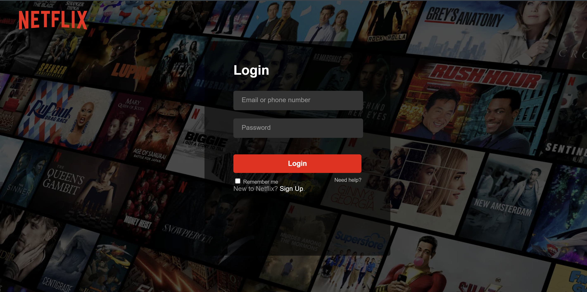

# Netflix Clone

[](https://nodejs.org/)
[](https://expressjs.com/)
[](https://www.mongodb.com/)
[](LICENSE)

A Netflix-inspired full-stack web application featuring a responsive user interface and a Node.js/Express backend with MongoDB persistence, JWT authentication, and HTTP-only cookie session management.

---

## 📌 Overview

This repository demonstrates a full-stack implementation of a Netflix-style web application combined with secure user authentication workflows.

Key areas implemented:
* **Landing Experience**: Replica of Netflix India's marketing landing page with feature cards and interactive FAQ accordions.
* **User Authentication**: Registration and login workflows with email/username validation, password hashing, and tokenized session cookies.
* **Session Guarded Dashboard**: Post-login Netflix dashboard featuring movie carousels, hero banners, top-10 lists, and category selectors.

---

## ✨ Key Features

- **Responsive Landing Page**: Netflix-style landing UI with interactive FAQ dropdown accordions.
- **User Registration**: Form validation, duplicate email/username handling, and salted password hashing via `bcryptjs`.
- **User Login**: Credential verification issuing 15-day HTTP-only `jwt-netflix` session cookies.
- **Protected Session Guard**: Pre-load session verification (`GET /api/v1/auth/authCheck`) validating JWT cookies before permitting dashboard access.
- **Logout Management**: Invalidates session cookies server-side and redirects users to the login screen.
- **Interactive Dashboard UI**: Rich Netflix media browsing interface powered by jQuery, Slick Carousel, Owl Carousel, and Bootstrap 4.

---

## 📸 Screenshot

<p align="center">
  
</p>

---


## 💻 Tech Stack

### Backend
* **Node.js** & **Express.js** (ES Modules)
* **MongoDB** & **Mongoose ODM**

### Security & Session Management
* **bcryptjs** (Password hashing)
* **jsonwebtoken** (JWT signing & verification)
* **cookie-parser** (Cookie extraction)
* **CORS** (Cross-origin credential handling)

### Frontend
* **HTML5** & **Vanilla CSS3**
* **JavaScript (ES6+)** & **Axios**
* **jQuery**, **Bootstrap 4**, **Slick Carousel**, **Owl Carousel**, **Select2**, **Font Awesome**

---

## 🏗️ Architecture

```
                               ┌─────────────────────────┐
                               │     Browser Client      │
                               │ (HTML / JS / jQuery)    │
                               └────────────┬────────────┘
                                            │
                                  HTTP (with Credentials)
                                            │
                                            ▼
                               ┌─────────────────────────┐
                               │  Express.js API Server  │
                               │     (server.js:5000)    │
                               └────────────┬────────────┘
                                            │
               ┌────────────────────────────┼────────────────────────────┐
               │                            │                            │
               ▼                            ▼                            ▼
   ┌───────────────────────┐   ┌────────────────────────┐   ┌────────────────────────┐
   │    Auth Controller    │   │ protectRoute Middleware│   │    generateToken.js    │
   │ (signup/login/logout) │   │ (verify JWT cookie)    │   │ (HTTP-only JWT cookie) │
   └───────────┬───────────┘   └────────────┬───────────┘   └────────────────────────┘
               │                            │
               └────────────────────────────┴────────────────────────────┐
                                                                         │
                                                                         ▼
                                                            ┌────────────────────────┐
                                                            │     MongoDB Database   │
                                                            │     (User Document)    │
                                                            └────────────────────────┘
```

---

## 📁 Project Structure

```
netflix-clone/
├── backend/
│   ├── config/
│   │   ├── db.js                 # Database connection setup
│   │   └── envVars.js            # Environment variable configuration
│   ├── controllers/
│   │   └── auth.controller.js    # Auth handlers (signup, login, logout, authCheck)
│   ├── middleware/
│   │   └── protectRoute.js       # JWT cookie protection middleware
│   ├── models/
│   │   └── user.model.js         # Mongoose User model
│   ├── routes/
│   │   └── auth.route.js         # Authentication API routes
│   ├── utils/
│   │   └── generateToken.js      # JWT generation & cookie helper
│   └── server.js                 # Express server entry point
├── frontend/
│   ├── index.html                # Landing page
│   └── src/
│       ├── login.html            # Login page
│       ├── signup.html           # Registration page
│       ├── index.js              # Landing page accordion handler
│       ├── js/
│       │   ├── login.js          # Login form logic & API request
│       │   └── signup.js         # Signup form logic & API request
│       ├── style/
│       │   ├── login.css         # Login page stylesheet
│       │   └── signup.css        # Signup page stylesheet
│       └── netflix/              # Authenticated streaming dashboard
│           ├── homepage.html     # Dashboard layout & session guard
│           ├── main.js           # Slider & carousel interactions
│           ├── style.css         # Dashboard stylesheet
│           └── (css/, js/, images/)
├── .gitignore
├── LICENSE
├── package.json
├── package-lock.json
└── README.md
```

---

## API Endpoints

| Method | Endpoint | Description | Auth Required |
| :--- | :--- | :--- | :---: |
| `POST` | `/api/v1/auth/signup` | Registers a new user account | No |
| `POST` | `/api/v1/auth/login` | Authenticates credentials & sets `jwt-netflix` cookie | No |
| `POST` | `/api/v1/auth/logout` | Clears authentication cookie | No |
| `GET` | `/api/v1/auth/authCheck` | Verifies JWT cookie and returns authenticated user | **Yes** |

---

## ⚡ Getting Started

### Prerequisites
* **Node.js**: v18.0.0 or higher
* **MongoDB**: Local MongoDB instance or MongoDB Atlas URI

### 1. Clone the Repository
```bash
git clone https://github.com/QuirkyNerd/netflix-clone.git
cd netflix-clone
```

### 2. Install Dependencies
```bash
npm install
```

### 3. Environment Variables
Create a `.env` file in the project root directory with the following variables:

```env
PORT=5000
MONGO_URI=mongodb://localhost:27017/netflix-clone
JWT_SECRET=your_jwt_secret_key
NODE_ENV=development
```

### 4. Start Backend Server
```bash
npm run dev
```
The Express server will start on `http://localhost:5000`.

### 5. Launch Frontend
Serve the `frontend/` directory using a local HTTP server (such as [VS Code Live Server](https://marketplace.visualstudio.com/items?itemName=ritwickdey.LiveServer) running on `http://127.0.0.1:5501` or `http://localhost:5500` to match CORS configuration).

---

## Security

* **Password Protection**: Passwords are salted and hashed with `bcryptjs` (salt factor 10) prior to persistence.
* **HTTP-Only Cookies**: JWT tokens are issued with `httpOnly: true`, helping mitigate XSS-based cookie access.
* **CSRF Mitigation**: Cookies use `sameSite: "strict"` to restrict cross-site cookie transmission.
* **HTTPS Flag**: Cookies use `secure: true` when `NODE_ENV === "production"`.
* **Password Exclude**: Sensitive password fields are explicitly excluded (`select("-password")`) from returned user data.
* **CORS Policy**: Configured to restrict origin access while supporting credentialed requests (`credentials: true`).

---

## 📄 License

This project is developed for academic and research demonstration purposes under the MIT License.

© 2026 Netflix Clone
